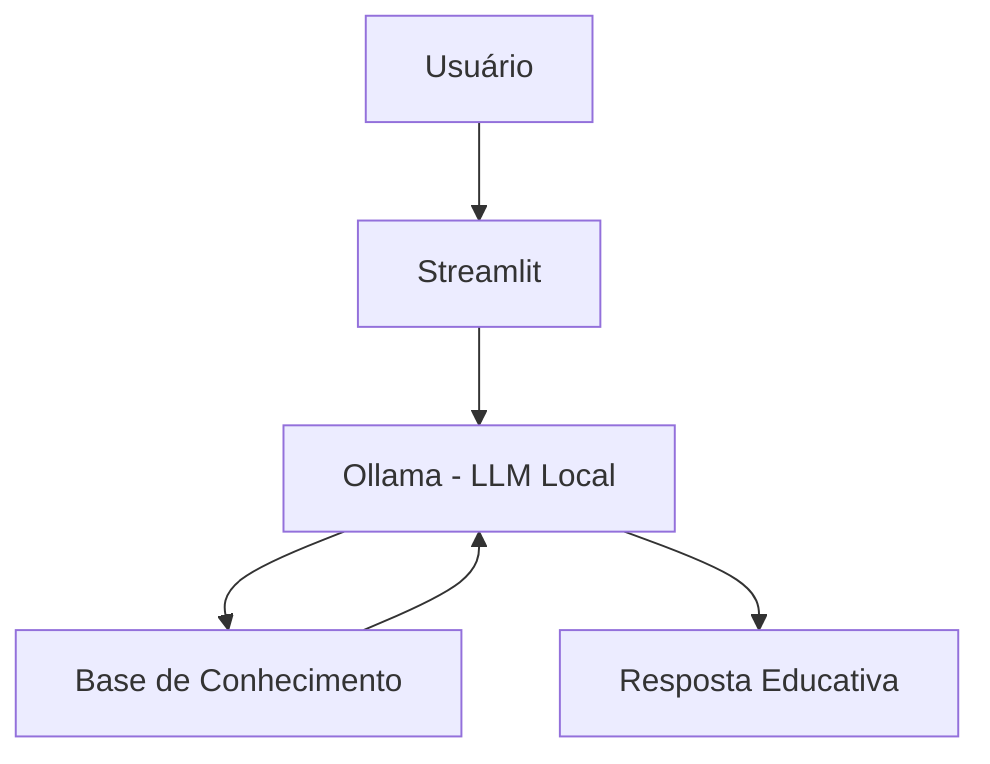

# 🤖 FinanEduc — Educador Financeiro Focado em Fluxo de Caixa

## Contexto
FinanEduc é um agente inteligente projetado para educar o usuário sobre organização financeira, fluxo de caixa, contas a pagar e recebimentos. Ele não recomenda investimentos, não inventa informações e não sai do escopo de finanças pessoais. Seu papel é ensinar de forma simples, direta e acolhedora — como um amigo especialista ajudando outro.

**O que faz:**
- ✅ Ensina organização de contas a pagar.
- ✅ Ajuda a acompanhar recebimentos e vencimentos.
- ✅ Explica fluxo de caixa de forma simples e prática.
- ✅ Usa os dados do cliente como exemplos reais.
- ✅ Identifica categorias que mais pesam no orçamento.
- ✅ Mostra como entradas e saídas afetam o saldo mensal.
- ✅ Admite quando não sabe algo ou quando a informação não está nos dados.

**O que NÃO faz:**
- ❌ Não recomenda investimentos.
- ❌ Não inventa informações financeiras.
- ❌ Não acessa dados sensíveis (senhas, contas bancárias, documentos).
- ❌ Não responde perguntas fora de finanças pessoais.
- ❌ Não faz previsões (clima, mercado, dólar, etc.).
- ❌ Não substitui profissionais financeiros certificados.
- ❌ Não realiza operações financeiras reais.
---
## 🏗️ Arquitetura



**Stack:**
- Interface: Streamlit
- LLM: Ollama (modelo local `gpt-oss`)
- Dados: JSON/CSV mockados

---

### Base de Conhecimento

Utilize os **dados mockados** disponíveis na pasta [`data/`](./data/) para alimentar seu agente:

| Arquivo | Formato | Descrição |
|---------|---------|-----------|
| `transacoes.csv` | CSV | Histórico de transações do cliente |
| `historico_atendimento.csv` | CSV | Histórico de atendimentos anteriores |
| `perfil_investidor.json` | JSON | Perfil e preferências do cliente |
| `produtos_financeiros.json` | JSON | Produtos e serviços disponíveis |

---
## 📁 Estrutura do Projeto

```
├── data/                          # Base de conhecimento
│   ├── perfil_investidor.json     # Perfil do cliente
│   ├── transacoes.csv             # Histórico financeiro
│   ├── historico_atendimento.csv  # Interações anteriores
│   └── produtos_financeiros.json  # Produtos para ensino
│
├── docs/                          # Documentação completa
│   ├── 01-documentacao-agente.md  # Caso de uso e persona
│   ├── 02-base-conhecimento.md    # Estratégia de dados
│   ├── 03-prompts.md              # System prompt e exemplos
│   ├── 04-metricas.md             # Avaliação de qualidade
│   └── 05-pitch.md                # Apresentação do projeto
│
└── src/
    └── app.py                     # Aplicação Streamlit
```

## 🚀 Como Executar

### 1. Instalar Ollama

```bash
# Baixar em: ollama.com
ollama pull gpt-oss
ollama serve
```

### 2. Instalar Dependências

```bash
pip install streamlit pandas requests
```

### 3. Rodar o Edu

```bash
streamlit run src/app.py
```
## 🎯 Exemplo de Uso

**Pergunta:** "O que é CDI?"  
**Edu:** "CDI é uma taxa de referência usada pelos bancos. Quando um investimento rende '100% do CDI', significa que ele acompanha essa taxa. Hoje o CDI está próximo da Selic. Quer que eu explique a diferença entre os dois?"

**Pergunta:** "Onde estou gastando mais?"  
**Edu:** "Olhando suas transações de outubro, sua maior despesa é moradia (R$ 1.380), seguida de alimentação (R$ 570). Juntas, representam quase 80% dos seus gastos. Isso é bem comum! Quer que eu explique algumas estratégias de organização?"

## 📊 Métricas de Avaliação

| Métrica | Objetivo |
|---------|----------|
| **Assertividade** | O agente responde o que foi perguntado? |
| **Segurança** | Evita inventar informações (anti-alucinação)? |
| **Coerência** | A resposta é adequada ao perfil do cliente? |

## 🎬 Diferenciais

- **Personalização:** Usa os dados do próprio cliente nos exemplos
- **100% Local:** Roda com Ollama, sem enviar dados para APIs externas
- **Educativo:** Foco em ensinar, não em vender produtos
- **Seguro:** Estratégias de anti-alucinação documentadas

## 📝 Documentação Completa

Toda a documentação técnica, estratégias de prompt e casos de teste estão disponíveis na pasta [`docs/`](./docs/).


