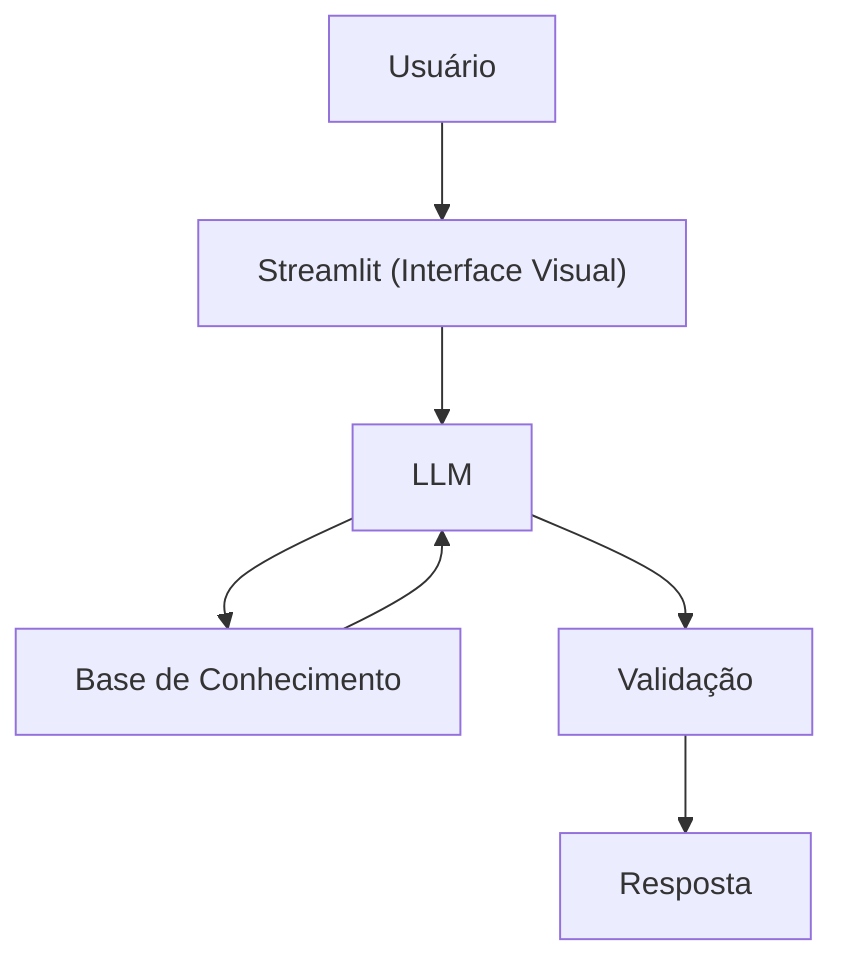

## Arquitetura

### Diagrama

### Componentes

| Componente | Descrição |
|------------|-----------|
| Interface | [Streamlit](https://streamlit.io/) |
| LLM | Ollama (local) |
| Base de Conhecimento | JSON/CSV mockados na pasta `data` |
| Validação | Regras de segurança + filtros anti-alucinação |
| Resposta | Texto final entregue ao usuário |

---
