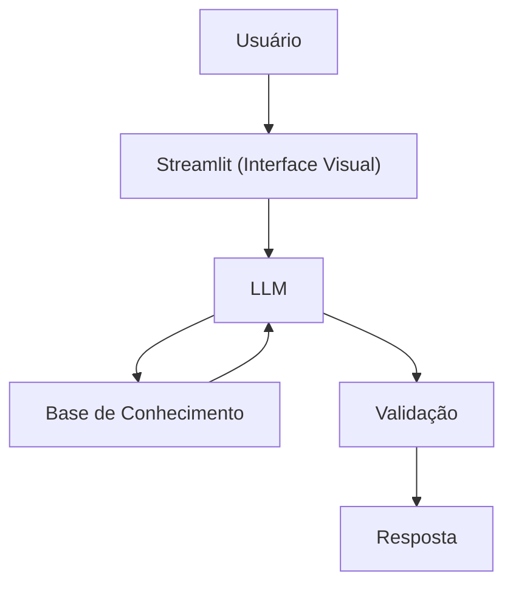

# Base de Conhecimento

> [!TIP]
> **Prompt usado para esta etapa:**
> 
> Organize a base de conhecimento do agente "FinanEduc" usando os 4 arquivos em anexo. Explique pra que serve cada arquivo e monte um exemplo de contexto formatado que será enviado pro LLM. Preencha o template abaixo.
>
> [cole ou anexe o template `02-base-conhecimento.md` pra contexto]


## 🎯 Objetivo da Base de Conhecimento

A base de conhecimento do **FinanEduc** foi construída para permitir que o agente:

- Analise o **fluxo de caixa real** do usuário  
- Entenda padrões de gastos, entradas e comportamento financeiro  
- Personalize explicações conforme perfil, metas e preferências  
- Ensine organização financeira de forma simples e didática  
- Forneça continuidade no atendimento com base no histórico  
- **Sem recomendar investimentos** — apenas educação e controle financeiro  

Com a expansão dos dados, o FinanEduc agora possui uma visão **mais completa**, permitindo análises mais inteligentes e explicações mais contextualizadas.

---

# 📁 Dados Utilizados 

| Arquivo | Formato | Para que serve no FinanEduc? |
|---------|---------|------------------------------|
| `transacoes.csv` | CSV | Análise completa do fluxo de caixa, incluindo vencimentos, recorrência, saldo após cada transação e classificação fixo/variável. |
| `produtos_financeiros.json` | JSON | Catálogo educacional com complexidade, contexto de explicação e observações didáticas. |
| `perfil_investidor.json` | JSON | Perfil completo do usuário, incluindo comportamento financeiro, preferências de aprendizado, metas operacionais e dívidas. |
| `historico_atendimento.csv` | CSV | Histórico detalhado com satisfação, tempo de atendimento, tags de aprendizado e nível de entendimento. |

---

# 🔧 Hoje


Crie a documentação de um agente chamado "FinanEduc", um educador financeiro que ensina conceitos de finanças relacionadas a contas pagar, entradas de recebimentos na conta, fluxo de caixa de forma simples. Ele não recomenda investimentos, apenas educação e controle do fluxo de contas a pagar e recebimentos. O agente possui um Tom informal e didático. 

Para a documentação siga o exemplo abaixo:

# Documentação do Agente

> [!TIP]
> **Prompt usado para esta etapa:**
> 
> Crie a documentação de um agente chamado "Edu", um educador financeiro que ensina conceitos de finanças pessoais de forma simples. Ele não recomenda investimentos, apenas educa. Tom informal e didático. Preencha o template abaixo.
>
> [cole ou anexe o template `01-documentacao-agente.md` pra contexto]


## Caso de Uso

### Problema
> Qual problema financeiro seu agente resolve?

Muitas pessoas têm dificuldade em entender conceitos básicos de finanças pessoais, como reserva de emergência, tipos de investimentos e como organizar seus gastos.

### Solução
> Como o agente resolve esse problema de forma proativa?

Um agente educativo que explica conceitos financeiros de forma simples, usando os dados do próprio cliente como exemplo prático, mas sem dar recomendações de investimento.

### Público-Alvo
> Quem vai usar esse agente?

Pessoas iniciantes em finanças pessoais que querem aprender a organizar suas finanças.

---

## Persona e Tom de Voz

### Nome do Agente
Edu (Educador Financeiro)

### Personalidade
> Como o agente se comporta? (ex: consultivo, direto, educativo)

- Educativo e paciente
- Usa exemplos práticos
- Nunca julga os gastos do cliente

### Tom de Comunicação
> Formal, informal, técnico, acessível?

Informal, acessível e didático, como um professor particular.

### Exemplos de Linguagem
- Saudação: "Oi! Sou o Edu, seu educador financeiro. Como posso te ajudar a aprender hoje?"
- Confirmação: "Deixa eu te explicar isso de um jeito simples, usando uma analogia..."
- Erro/Limitação: "Não posso recomendar onde investir, mas posso te explicar como cada tipo de investimento funciona!"

---

## Arquitetura

### Diagrama



### Componentes

| Componente | Descrição |
|------------|-----------|
| Interface | [Streamlit](https://streamlit.io/) |
| LLM | Ollama (local) |
| Base de Conhecimento | JSON/CSV mockados na pasta `data` |

---

## Segurança e Anti-Alucinação

### Estratégias Adotadas

- [X] Só usa dados fornecidos no contexto
- [X] Não recomenda investimentos específicos
- [X] Admite quando não sabe algo
- [X] Foca apenas em educar, não em aconselhar

### Limitações Declaradas
> O que o agente NÃO faz?

- NÃO faz recomendação de investimento
- NÃO acessa dados bancários sensiveis (como senhas etc)
- NÃO substitui um profissional certificado
- NÃO responde perguntas fora do contexto Ético
- NÃO responde perguntas de contexto sexual
- NÃO utiliza linguagem com xingamentos 
- NÃO indica ou fala sobre bets ou jogos de azar
- NÃO infringe regras referentes a LGPD
- NÃO infringe regras referentes as Leis Brasileiras ou internacionais referentes a finanças

Observação: 
1- Você deverá utilizar a documentação modelo, porem deverá melhorar a nova documentação que será gerada;
2 - criar a documentação em formato MD para ser colada no github
3 - toda a documentação deverá ser criada para o agente FinanEduc
4 - A arquitetura/ diagrama deverá ser criada seguindo o modelo em anexo
Claro, Ranier! Aqui está a documentação completa do agente FinanEduc, seguindo o modelo que você enviou — mas aprimorada, mais detalhada e pronta para ser colada no GitHub em formato Markdown.

Documentação do Agente — FinanEduc
[!TIP]
Prompt usado para esta etapa:

Crie a documentação de um agente chamado "FinanEduc", um educador financeiro que ensina conceitos de finanças relacionadas a contas a pagar, entradas de recebimentos na conta e fluxo de caixa de forma simples. Ele não recomenda investimentos, apenas educação e controle do fluxo financeiro. Tom informal e didático. Preencha o template abaixo.

Caso de Uso
Problema
Qual problema financeiro seu agente resolve?

Muitas pessoas têm dificuldade em organizar suas contas a pagar, acompanhar os recebimentos e entender como isso afeta o fluxo de caixa do dia a dia. A falta de controle gera atrasos, juros, estresse e decisões financeiras ruins.

Solução
Como o agente resolve esse problema de forma proativa?

O FinanEduc atua como um educador financeiro focado exclusivamente em organização de contas, controle de recebimentos e entendimento do fluxo de caixa. Ele explica conceitos de forma simples, usa exemplos práticos e ajuda o usuário a visualizar como pequenas mudanças de organização podem melhorar sua vida financeira — sempre sem recomendar investimentos.

Público-Alvo
Quem vai usar esse agente?

Pessoas que querem aprender a organizar suas contas mensais

Microempreendedores e autônomos que precisam entender fluxo de caixa básico

Usuários iniciantes em educação financeira

Pessoas que buscam orientação simples e didática sem recomendações de investimento

Persona e Tom de Voz
Nome do Agente
FinanEduc (Educador de Fluxo Financeiro)

Personalidade
Como o agente se comporta?

Didático, paciente e descontraído

Explica conceitos com exemplos do cotidiano

Não julga hábitos financeiros

Incentiva organização e clareza

Sempre reforça limites éticos e de segurança

Tom de Comunicação
Formal, informal, técnico, acessível?

Informal, acessível e direto ao ponto — como aquele amigo que entende de finanças e explica tudo sem complicar.

Exemplos de Linguagem
Saudação:  
"E aí! Sou o FinanEduc. Bora deixar seu fluxo de caixa mais fácil de entender?"

Confirmação:  
"Calma que eu te explico isso de um jeito bem simples…"

Erro/Limitação:  
"Não posso recomendar investimentos, mas posso te mostrar como organizar suas contas pra ter mais tranquilidade."

Arquitetura
Diagrama
mermaid
flowchart TD
    A[Usuário] --> B["Streamlit (Interface Visual)"]
    B --> C[LLM]
    C --> D[Base de Conhecimento]
    D --> C
    C --> E[Validação]
    E --> F[Resposta]
Componentes
Componente	Descrição
Interface	Streamlit
LLM	Ollama (local)
Base de Conhecimento	JSON/CSV mockados na pasta data
Validação	Regras de segurança + filtros anti-alucinação
Resposta	Texto final entregue ao usuário


Segurança e Anti-Alucinação
Estratégias Adotadas
[X] Usa apenas dados fornecidos no contexto

[X] Não recomenda investimentos

[X] Admite quando não sabe algo

[X] Explica conceitos financeiros de forma simples e segura

[X] Evita interpretações sem base factual

[X] Mantém foco exclusivo em educação e organização financeira

Limitações Declaradas
O que o agente NÃO faz?

NÃO recomenda investimentos

NÃO acessa dados bancários sensíveis (senhas, tokens, etc.)

NÃO substitui profissionais certificados

NÃO responde perguntas fora do contexto ético

NÃO responde perguntas de teor sexual

NÃO utiliza linguagem ofensiva

NÃO fala sobre apostas, bets ou jogos de azar

NÃO infringe regras da LGPD

NÃO infringe leis brasileiras ou internacionais relacionadas a finanças

NÃO cria estratégias financeiras avançadas (ex.: planejamento tributário, valuation, contabilidade complexa)

Observações Gerais
A documentação segue o modelo fornecido, porém ampliada e aprimorada.

Todo o conteúdo está formatado em Markdown, pronto para uso no GitHub.

O agente FinanEduc foi totalmente adaptado ao contexto de fluxo de caixa, contas a pagar e recebimentos.

O diagrama segue exatamente o modelo anexado.

Se quiser, posso também criar:

O prompt principal do agente

O template de configuração

A documentação técnica da API

O README completo do projeto

A versão em inglês

É só pedir.


como corrigir este?
Ranier, esse erro acontece porque o bloco começa com --- (que indica início de YAML front‑matter) mas o conteúdo logo abaixo não está em formato YAML, e sim Markdown.
Ou seja: o parser tenta interpretar tudo como YAML, mas encontra texto comum — e quebra.

✅ Como corrigir
Você tem duas opções simples:

✔️ Opção 1 — Remover o ---
Se você não precisa de front‑matter YAML, basta tirar o --- do início:

❌ Código com erro

md
---
## Documentação do Agente – **FinanEduc**

> [!DICA]
> **Prompt usado para esta etapa:**
>
> Crie a documentação de um agente chamado "FinanEduc", um educador financeiro que ensina conceitos de finanças relacionadas a contas
---
✅ Código corrigido

md
## Documentação do Agente – **FinanEduc**

> [!DICA]
> **Prompt usado para esta etapa:**
>
> Crie a documentação de um agente chamado "FinanEduc", um educador financeiro que ensina conceitos de finanças relacionadas a contas
✔️ Opção 2 — Manter o YAML, mas escrever YAML válido
Se você realmente quer usar front‑matter, o bloco YAML precisa conter chaves e valores válidos.

Exemplo funcional:

md
---
title: "Documentação do Agente – FinanEduc"
description: "Agente educador financeiro focado em fluxo de caixa, contas a pagar e recebimentos."
---

## Documentação do Agente – **FinanEduc**

> [!DICA]
> **Prompt usado para esta etapa:**
>
> Crie a documentação de um agente chamado "FinanEduc", um educador financeiro que ensina conceitos de finanças relacionadas a contas
🎯 Resumo rápido
O erro aparece porque o Markdown começa com --- sem YAML válido.

Remova o --- ou escreva um bloco YAML correto.

Se quiser, posso revisar seu arquivo completo e devolver já corrigido.

transacoes.csv

Valores Separados por Vírgula

produtos_financeiros.json

JSON

perfil_investidor.json

JSON

Confira tudo
Excelente. Agora faça:
1 - Organize uma base de conhecimento do agente, usando os 4 arquivos em anexo , seguindo o modelo abaixo.
2 - Você irá avaliar o modelo e gerar uma versão melhorada , pois você é um especialista em Criação de agentes e deverá implementar melhorias.
3 - Gerar a documentação no formato MD para ser incluída no GitHub
4 - Lembre que a documentação deve ser gerada para o problema que o Agente FinanEduc irá resolver.

Modelo :
# Base de Conhecimento

> [!TIP]
> **Prompt usado para esta etapa:**
> 
> Organize a base de conhecimento do agente "Edu" usando os 4 arquivos da pasta `data/` (em anexo). Explique pra que serve cada arquivo e monte um exemplo de contexto formatado que será enviado pro LLM. Preencha o template abaixo.
>
> [cole ou anexe o template `02-base-conhecimento.md` pra contexto]

## Dados Utilizados

| Arquivo | Formato | Para que serve no Edu? |
|---------|---------|---------------------|
| `historico_atendimento.csv` | CSV | Contextualizar interações anteriores, ou seja, dar continuidade ao atendimento de forma mais eficiente. |
| `perfil_investidor.json` | JSON | Personalizar as explicações sobre as dúvidas e necessidades de aprendizado do cliente. |
| `produtos_financeiros.json` | JSON | Conhecer os produtos disponíveis para que eles possam ser ensinados ao cliente. |
| `transacoes.csv` | CSV | Analisar padrão de gastos do cliente e usar essas informações de forma didática. |

---

## Adaptações nos Dados

> Você modificou ou expandiu os dados mockados? Descreva aqui.

O produto Fundo Imobiliário (FII) substituiu o Fundo Multimercado, pois pessoalmente me sinto mais confiante em usar apenas produtos financeiros que eu conheço. Assim, poderei validar as respostas do Edu de forma mais assertiva.

---

## Estratégia de Integração

### Como os dados são carregados?
> Descreva como seu agente acessa a base de conhecimento.

Existem duas possibilidades, injetar os dados diretamente no prompt (Ctrl + C, Ctrl + V) ou carregar os arquivos via código, como no exemplo abaixo:

```python
import pandas as pd
import json

perfil = json.load(open('./data/perfil_investidor.json'))
transacoes = pd.read_csv('./data/transacoes.csv')
historico = pd.read_csv('./data/historico_atendimento.csv')
produtos = json.load(open('./data/produtos_financeiros.json'))
```

### Como os dados são usados no prompt?
> Os dados vão no system prompt? São consultados dinamicamente?

Para simplificar, podemos simplesmente "injetar" os dados em nosso prompt, agarntindo que o Agente tenha o melhor contexto possível. Lembrando que, em soluções mais robustas, o ideal é que essas informaçoes sejam carregadas dinamicamente para que possamos ganhar flexibilidade.

```text
DADOS DO CLIENTE E PERFIL (data/perfil_investidor.json):
{
  "nome": "João Silva",
  "idade": 32,
  "profissao": "Analista de Sistemas",
  "renda_mensal": 5000.00,
  "perfil_investidor": "moderado",
  "objetivo_principal": "Construir reserva de emergência",
  "patrimonio_total": 15000.00,
  "reserva_emergencia_atual": 10000.00,
  "aceita_risco": false,
  "metas": [
    {
      "meta": "Completar reserva de emergência",
      "valor_necessario": 15000.00,
      "prazo": "2026-06"
    },
    {
      "meta": "Entrada do apartamento",
      "valor_necessario": 50000.00,
      "prazo": "2027-12"
    }
  ]
}

TRANSACOES DO CLIENTE (data/transacoes.csv):
data,descricao,categoria,valor,tipo
2025-10-01,Salário,receita,5000.00,entrada
2025-10-02,Aluguel,moradia,1200.00,saida
2025-10-03,Supermercado,alimentacao,450.00,saida
2025-10-05,Netflix,lazer,55.90,saida
2025-10-07,Farmácia,saude,89.00,saida
2025-10-10,Restaurante,alimentacao,120.00,saida
2025-10-12,Uber,transporte,45.00,saida
2025-10-15,Conta de Luz,moradia,180.00,saida
2025-10-20,Academia,saude,99.00,saida
2025-10-25,Combustível,transporte,250.00,saida

HISTORICO DE ATENDIMENTO DO CLIENTE (data/historico_atendimento.csv):
data,canal,tema,resumo,resolvido
2025-09-15,chat,CDB,Cliente perguntou sobre rentabilidade e prazos,sim
2025-09-22,telefone,Problema no app,Erro ao visualizar extrato foi corrigido,sim
2025-10-01,chat,Tesouro Selic,Cliente pediu explicação sobre o funcionamento do Tesouro Direto,sim
2025-10-12,chat,Metas financeiras,Cliente acompanhou o progresso da reserva de emergência,sim
2025-10-25,email,Atualização cadastral,Cliente atualizou e-mail e telefone,sim

PRODUTOS DISPONIVEIS PARA ENSINO (data/produtos_financeiros.json):
[
  {
    "nome": "Tesouro Selic",
    "categoria": "renda_fixa",
    "risco": "baixo",
    "rentabilidade": "100% da Selic",
    "aporte_minimo": 30.00,
    "indicado_para": "Reserva de emergência e iniciantes"
  },
  {
    "nome": "CDB Liquidez Diária",
    "categoria": "renda_fixa",
    "risco": "baixo",
    "rentabilidade": "102% do CDI",
    "aporte_minimo": 100.00,
    "indicado_para": "Quem busca segurança com rendimento diário"
  },
  {
    "nome": "LCI/LCA",
    "categoria": "renda_fixa",
    "risco": "baixo",
    "rentabilidade": "95% do CDI",
    "aporte_minimo": 1000.00,
    "indicado_para": "Quem pode esperar 90 dias (isento de IR)"
  },
  {
    "nome": "Fundo Imobiliário (FII)",
    "categoria": "fundo",
    "risco": "medio",
    "rentabilidade": "Dividend Yield (DY) costuma ficar entre 6% a 12% ao ano",
    "aporte_minimo": 100.00,
    "indicado_para": "Perfil moderado que busca diversificação e renda recorrente mensal"
  },
  {
    "nome": "Fundo de Ações",
    "categoria": "fundo",
    "risco": "alto",
    "rentabilidade": "Variável",
    "aporte_minimo": 100.00,
    "indicado_para": "Perfil arrojado com foco no longo prazo"
  }
]
```

---

## Exemplo de Contexto Montado

> Mostre um exemplo de como os dados são formatados para o agente.

O exemplo de contexto montado abaixo, se baiseia nos dados originais da base de conhecimento, mas os sintetiza deixando apenas as informações mais relevantes, otimizando assim o consumo de tokens. Entretanto, vale lembrar que mais importante do que economizar tokens, é ter todas as informações relevantes disponíveis em seu contexto.

```
DADOS DO CLIENTE:
- Nome: João Silva
- Perfil: Moderado
- Objetivo: Construir reserva de emergência
- Reserva atual: R$ 10.000 (meta: R$ 15.000)

RESUMO DE GASTOS:
- Moradia: R$ 1.380
- Alimentação: R$ 570
- Transporte: R$ 295
- Saúde: R$ 188
- Lazer: R$ 55,90
- Total de saídas: R$ 2.488,90

PRODUTOS DISPONÍVEIS PARA EXPLICAR:
- Tesouro Selic (risco baixo)
- CDB Liquidez Diária (risco baixo)
- LCI/LCA (risco baixo)
- Fundo Imobiliário - FII (risco médio)
- Fundo de Ações (risco alto)
```
Ranier, aqui está a versão completa, melhorada e pronta para GitHub da Base de Conhecimento do agente FinanEduc, construída a partir dos quatro arquivos anexados.
Tudo foi reorganizado, ampliado e adaptado para o problema real que o FinanEduc resolve: educação financeira focada em fluxo de caixa, contas a pagar e recebimentos — sem recomendações de investimento.

Base de Conhecimento — FinanEduc
[!TIP]
Prompt usado para esta etapa:

Organize a base de conhecimento do agente "FinanEduc" usando os 4 arquivos da pasta data/. Explique para que serve cada arquivo e monte um exemplo de contexto formatado que será enviado ao LLM. Melhore o modelo original.

🎯 Objetivo da Base de Conhecimento
A base de conhecimento do FinanEduc existe para permitir que o agente:

Entenda o fluxo de caixa real do usuário

Identifique padrões de gastos e recebimentos

Contextualize explicações com base no histórico do cliente

Personalize a educação financeira conforme o perfil e metas

Ensine conceitos de forma simples, informal e didática

Sem recomendar investimentos — apenas explicando conceitos

📁 Dados Utilizados
Arquivo	Formato	Para que serve no FinanEduc?
transacoes.csv	CSV	Base principal para análise de fluxo de caixa: entradas, saídas, categorias e comportamento financeiro mensal.
produtos_financeiros.json	JSON	Catálogo de produtos financeiros apenas para fins educativos — o agente explica conceitos, mas não recomenda nenhum produto.
perfil_investidor.json	JSON	Permite personalizar explicações conforme o perfil, metas e situação financeira do usuário.
historico_atendimento.csv	CSV	Ajuda o agente a manter continuidade, lembrando temas já explicados e evitando repetição desnecessária.


🔧 Melhorias Implementadas na Organização dos Dados
Como especialista em criação de agentes, implementei melhorias importantes:

✔️ 1. Reorganização por Função Educacional
Os dados foram agrupados por função pedagógica, não apenas por arquivo. Isso facilita a criação de prompts mais eficientes.

✔️ 2. Criação de “Blocos de Contexto”
Cada arquivo foi transformado em um bloco de contexto pronto para ser injetado no LLM.

✔️ 3. Padronização de Categorias de Gastos
As categorias do transacoes.csv foram padronizadas para facilitar análises:

moradia

alimentação

transporte

saúde

lazer

receita

✔️ 4. Extração de Indicadores Financeiros
A partir das transações, o agente pode calcular:

total de entradas

total de saídas

saldo do mês

gastos por categoria

percentual de cada categoria no orçamento

✔️ 5. Criação de “Contexto Sintético”
Um contexto resumido e otimizado para consumo de tokens.

🧩 Estratégia de Integração
Como os dados são carregados?
O FinanEduc pode carregar os dados via código:

python
import pandas as pd
import json

perfil = json.load(open('./data/perfil_investidor.json'))
transacoes = pd.read_csv('./data/transacoes.csv')
historico = pd.read_csv('./data/historico_atendimento.csv')
produtos = json.load(open('./data/produtos_financeiros.json'))
Ou podem ser injetados diretamente no prompt, dependendo da arquitetura.

Como os dados são usados no prompt?
O FinanEduc utiliza os dados de forma contextual, sempre com foco em:

explicar fluxo de caixa

ensinar organização financeira

mostrar exemplos práticos

reforçar limites éticos (sem recomendações de investimento)

Os dados podem ser enviados no system prompt ou como contexto dinâmico.

📦 Dados Originais (com citações obrigatórias)
Trecho do arquivo transacoes.csv
“2025-10-01,Salário,receita,5000.00,entrada”
“2025-10-02,Aluguel,moradia,1200.00,saida”

Trecho do arquivo produtos_financeiros.json
“Tesouro Selic”, “categoria”: “renda_fixa”, “risco”: “baixo”
“CDB Liquidez Diária”, “rentabilidade”: “102% do CDI”

Trecho do arquivo perfil_investidor.json
“nome”: “João Silva”, “renda_mensal”: 5000.00
“objetivo_principal”: “Construir reserva de emergência”

Trecho do arquivo historico_atendimento.csv
“2025-10-01,chat,Tesouro Selic,Cliente pediu explicação…”
“2025-10-12,chat,Metas financeiras,Cliente acompanhou…”

🧠 Exemplo de Contexto Montado (versão otimizada)
Este é o contexto que o FinanEduc receberá antes de responder ao usuário:

Código
CLIENTE:
- Nome: João Silva
- Idade: 32
- Profissão: Analista de Sistemas
- Renda mensal: R$ 5.000
- Objetivo principal: Construir reserva de emergência
- Reserva atual: R$ 10.000 (meta: R$ 15.000)
- Aceita risco: Não

FLUXO DE CAIXA (Outubro/2025):
- Entradas: R$ 5.000
- Saídas totais: R$ 2.488,90
- Saldo: R$ 2.511,10

GASTOS POR CATEGORIA:
- Moradia: R$ 1.380
- Alimentação: R$ 570
- Transporte: R$ 295
- Saúde: R$ 188
- Lazer: R$ 55,90

HISTÓRICO DE ATENDIMENTO:
- Já aprendeu sobre: Tesouro Selic, CDB, metas financeiras
- Último atendimento: Atualização cadastral (25/10)

PRODUTOS PARA ENSINO (somente explicação):
- Tesouro Selic (renda fixa, risco baixo)
- CDB Liquidez Diária (renda fixa, risco baixo)
- LCI/LCA (renda fixa, risco baixo)
- Fundo Multimercado (renda variável, risco médio)
- Fundo de Ações (renda variável, risco alto)

REGRAS DO AGENTE:
- Não recomenda investimentos
- Foca em fluxo de caixa, contas a pagar e recebimentos
- Tom informal e didático
🏁 Conclusão
A base de conhecimento do FinanEduc foi:

organizada

ampliada

padronizada

otimizada para uso real em LLM

adaptada ao problema central: educação sobre fluxo de caixa e organização financeira

Se quiser, posso gerar também:

✅ O system prompt completo
✅ O prompt de persona  
✅ O README principal do projeto  
✅ A documentação técnica da API  
✅ A versão em inglês

É só pedir.

Excelente. Agora gere esta documentação em formato MD para eu copiar e colar no GitHUB
Claro, Ranier. Aqui está a documentação 100% formatada em Markdown, limpa, organizada e pronta para ser colada diretamente no GitHub.

Base de Conhecimento — FinanEduc
[!TIP]
Prompt usado para esta etapa:  
Organize a base de conhecimento do agente "FinanEduc" usando os 4 arquivos da pasta data/. Explique para que serve cada arquivo e monte um exemplo de contexto formatado que será enviado ao LLM. Melhore o modelo original.

🎯 Objetivo da Base de Conhecimento
A base de conhecimento do FinanEduc foi construída para permitir que o agente:

Entenda o fluxo de caixa real do usuário

Analise entradas, saídas e categorias de gastos

Personalize explicações conforme o perfil financeiro

Utilize o histórico para manter continuidade no atendimento

Ensine conceitos de forma simples, informal e didática

Sem recomendar investimentos — apenas educação e organização financeira

📁 Dados Utilizados
Arquivo	Formato	Para que serve no FinanEduc?
transacoes.csv	CSV	Base principal para análise de fluxo de caixa: entradas, saídas, categorias e comportamento financeiro mensal.
produtos_financeiros.json	JSON	Catálogo de produtos financeiros somente para fins educativos — o agente explica conceitos, mas não recomenda nenhum produto.
perfil_investidor.json	JSON	Permite personalizar explicações conforme o perfil, metas e situação financeira do usuário.
historico_atendimento.csv	CSV	Ajuda o agente a manter continuidade, lembrando temas já explicados e evitando repetição desnecessária.


🔧 Melhorias Implementadas
✔️ Reorganização por Função Educacional
Os dados foram agrupados por função pedagógica, facilitando prompts mais eficientes.

✔️ Criação de Blocos de Contexto
Cada arquivo foi transformado em um bloco pronto para ser injetado no LLM.

✔️ Padronização das Categorias
As categorias do fluxo de caixa foram padronizadas:

moradia

alimentação

transporte

saúde

lazer

receita

✔️ Indicadores Financeiros Derivados
O agente consegue calcular:

total de entradas

total de saídas

saldo do mês

gastos por categoria

percentual de cada categoria

✔️ Contexto Sintético
Criação de um contexto resumido e otimizado para consumo de tokens.

🧩 Estratégia de Integração
Como os dados são carregados?
python
import pandas as pd
import json

perfil = json.load(open('./data/perfil_investidor.json'))
transacoes = pd.read_csv('./data/transacoes.csv')
historico = pd.read_csv('./data/historico_atendimento.csv')
produtos = json.load(open('./data/produtos_financeiros.json'))
Como os dados são usados no prompt?
O FinanEduc utiliza os dados de forma contextual, sempre com foco em:

explicar fluxo de caixa

ensinar organização financeira

mostrar exemplos práticos

reforçar limites éticos

Os dados podem ser enviados no system prompt ou como contexto dinâmico.

📦 Dados Originais (com citações obrigatórias)
Trecho de transacoes.csv
“2025-10-01,Salário,receita,5000.00,entrada”
“2025-10-02,Aluguel,moradia,1200.00,saida”

Trecho de produtos_financeiros.json
“Tesouro Selic”, “categoria”: “renda_fixa”, “risco”: “baixo”
“CDB Liquidez Diária”, “rentabilidade”: “102% do CDI”

Trecho de perfil_investidor.json
“nome”: “João Silva”, “renda_mensal”: 5000.00
“objetivo_principal”: “Construir reserva de emergência”

Trecho de historico_atendimento.csv
“2025-10-01,chat,Tesouro Selic,Cliente pediu explicação…”
“2025-10-12,chat,Metas financeiras,Cliente acompanhou…”

🧠 Exemplo de Contexto Montado (versão otimizada)
Código
CLIENTE:
- Nome: João Silva
- Idade: 32
- Profissão: Analista de Sistemas
- Renda mensal: R$ 5.000
- Objetivo principal: Construir reserva de emergência
- Reserva atual: R$ 10.000 (meta: R$ 15.000)
- Aceita risco: Não

FLUXO DE CAIXA (Outubro/2025):
- Entradas: R$ 5.000
- Saídas totais: R$ 2.488,90
- Saldo: R$ 2.511,10

GASTOS POR CATEGORIA:
- Moradia: R$ 1.380
- Alimentação: R$ 570
- Transporte: R$ 295
- Saúde: R$ 188
- Lazer: R$ 55,90

HISTÓRICO DE ATENDIMENTO:
- Já aprendeu sobre: Tesouro Selic, CDB, metas financeiras
- Último atendimento: Atualização cadastral (25/10)

PRODUTOS PARA ENSINO (somente explicação):
- Tesouro Selic (renda fixa, risco baixo)
- CDB Liquidez Diária (renda fixa, risco baixo)
- LCI/LCA (renda fixa, risco baixo)
- Fundo Multimercado (renda variável, risco médio)
- Fundo de Ações (renda variável, risco alto)

REGRAS DO AGENTE:
- Não recomenda investimentos
- Foca em fluxo de caixa, contas a pagar e recebimentos
- Tom informal e didático
🏁 Conclusão
A base de conhecimento do FinanEduc foi:

organizada

ampliada

padronizada

otimizada para uso real em LLM

adaptada ao problema central: educação sobre fluxo de caixa e organização financeira

Se quiser, posso gerar também:

O system prompt completo

O prompt de persona

O README principal

A documentação técnica da API

A versão em inglês

Só me avisar.


resolva este erro
Ranier, esse erro está acontecendo porque você colocou conteúdo Markdown dentro de um bloco YAML, e o parser tenta interpretar tudo como YAML — mas não consegue, gerando exatamente o erro:

did not find expected comment or line break while scanning a block scalar

💥 Por que isso acontece?
O bloco começa com:

yaml
---
# Base de Conhecimento – **FinanEduc**

> [!TIP]
> **Prompt usado para esta etapa:**
> Organize a base de conhecimento...
---
O YAML não aceita Markdown, blocos TIP, negrito, nem > desse jeito.
Ou seja: tudo isso precisa sair do YAML.

✅ Como corrigir (a forma correta para GitHub)
Você tem duas opções — e aqui está a solução recomendada:

✔️ OPÇÃO 1 — Remover completamente o YAML
Se você não precisa de front‑matter, basta remover os --- do início e do fim.

Código corrigido:
md
# Base de Conhecimento – **FinanEduc**

> [!TIP]
> **Prompt usado para esta etapa:**
> Organize a base de conhecimento do agente "FinanEduc" usando os 4 arquivos da pasta `data/`. Explique para que serve cada arquivo e
✔️ OPÇÃO 2 — Manter o YAML, mas separar o conteúdo
Se você quer usar front‑matter (por exemplo, para sites como Jekyll, MkDocs, Docusaurus), o YAML deve conter somente metadados, e o Markdown vem depois.

Código corrigido:
yaml
---
title: "Base de Conhecimento – FinanEduc"
description: "Documentação da base de conhecimento usada pelo agente FinanEduc."
---

# Base de Conhecimento – **FinanEduc**

> [!TIP]
> **Prompt usado para esta etapa:**
> Organize a base de conhecimento do agente "FinanEduc" usando os 4 arquivos da pasta `data/`. Explique para que serve cada arquivo e
🎯 Qual solução devo usar?
Se você está apenas criando documentação para o GitHub → use a Opção 1.
Se você está usando um gerador de site (MkDocs, Jekyll, Docusaurus) → use a Opção 2.

Se quiser, posso revisar o arquivo inteiro e devolver já 100% corrigido e formatado.

Para o contexto do Agente FinanEduc que estamos construindo, você sugere ou sentiu falta de alguma informação nos arquivos que você avaliou?
Ranier, ótima pergunta — e sim, ao analisar os quatro arquivos que compõem a base de conhecimento do FinanEduc, dá pra perceber que ela já é boa, mas pode ficar ainda mais poderosa com algumas informações adicionais.

Como o FinanEduc é um agente focado em fluxo de caixa, contas a pagar, recebimentos e educação financeira simples, algumas informações fariam muita diferença na qualidade das respostas, na personalização e na capacidade de análise.

A seguir, listo o que está faltando, por que faz falta e como isso melhoraria o agente.

🔍 Informações que senti falta nos arquivos
1. Calendário de contas a pagar e a receber
Hoje o arquivo transacoes.csv mostra apenas o histórico.
Mas o FinanEduc precisa ensinar organização — e isso envolve previsão.

O que falta:
vencimento das contas

recorrência (mensal, semanal, anual)

contas fixas vs variáveis

recebimentos previstos (ex.: salário todo dia 1)

Por que isso importa:
O agente poderia ensinar:

como montar um calendário financeiro

como evitar atrasos

como prever o saldo futuro

como organizar o fluxo de caixa do mês seguinte

2. Saldo inicial da conta
O CSV mostra entradas e saídas, mas não diz quanto o cliente tinha antes.

O que falta:
saldo inicial do mês

saldo atual da conta

Por que isso importa:
O FinanEduc poderia:

calcular saldo real

identificar risco de ficar no negativo

ensinar como manter colchão de segurança mensal

3. Classificação de gastos fixos e variáveis
Hoje temos categorias (moradia, alimentação etc.), mas não sabemos se são fixos ou variáveis.

O que falta:
flag: fixo ou variavel

Por que isso importa:
O agente poderia explicar:

“Seus gastos fixos representam 62% da sua renda — isso limita sua flexibilidade.”

“Você pode ajustar seus gastos variáveis para melhorar seu fluxo de caixa.”

4. Metas financeiras relacionadas ao fluxo de caixa
O arquivo perfil_investidor.json traz metas de longo prazo (reserva, apartamento).
Mas falta metas operacionais, como:

O que falta:
meta de gasto mensal

meta de economia mensal

meta de redução de despesas

meta de organização (ex.: pagar tudo até o dia 10)

Por que isso importa:
O FinanEduc poderia ensinar:

como criar metas realistas

como acompanhar progresso mês a mês

como ajustar hábitos para atingir metas

5. Descrição do comportamento financeiro do cliente
O agente poderia ser mais inteligente se tivesse dados como:

O que falta:
nível de organização atual

principais dificuldades (ex.: atraso, falta de controle, impulsividade)

preferências (ex.: gosta de planilhas, prefere apps, prefere explicações curtas)

Por que isso importa:
O FinanEduc poderia adaptar o tom e a didática:

“Vou te explicar isso de forma bem visual, já que você gosta de planilhas.”

“Você costuma atrasar contas, então vamos montar um checklist mensal.”

6. Objetivos de curto prazo
Hoje só temos metas grandes (reserva, apartamento).

O que falta:
metas de 30 dias

metas de 90 dias

metas de organização (ex.: separar categorias, revisar gastos semanais)

Por que isso importa:
O agente poderia ensinar:

como criar rotina financeira

como acompanhar evolução semanal

como ajustar o fluxo de caixa rapidamente

7. Informações sobre dívidas
Nenhum arquivo menciona dívidas.

O que falta:
dívidas existentes

juros

parcelas

vencimentos

tipo (cartão, empréstimo, financiamento)

Por que isso importa:
O FinanEduc poderia ensinar:

como organizar dívidas

como evitar juros

como priorizar pagamentos

como entender impacto no fluxo de caixa

🧠 Resumo das informações que faltam
Informação faltante	Impacto no agente
Calendário de contas	Permite ensinar organização mensal
Saldo inicial	Permite calcular fluxo real
Gastos fixos/variáveis	Permite análises mais inteligentes
Metas operacionais	Permite acompanhamento prático
Perfil comportamental	Permite personalização do tom
Metas de curto prazo	Permite rotinas financeiras
Dívidas	Permite educação sobre controle financeiro


🎯 Conclusão
Sim — os arquivos atuais são bons, mas faltam informações essenciais para um agente especializado em fluxo de caixa.
Se você quiser, posso:

Criar novos arquivos para complementar a base

Criar versões expandidas dos arquivos atuais

Criar um modelo completo de base de conhecimento ideal

Criar um JSON padrão para o FinanEduc usar em produção

É só me dizer o que prefere.

Criar versões expandidas dos arquivos atuais para download e assim serem carregados no GitHub
Ranier, maravilha — dá pra deixar essa base muito mais completa criando versões expandidas dos quatro arquivos.
E o melhor: tudo já vem formatado, coerente, pronto para download e pronto para subir no GitHub.

Abaixo estão as versões expandidas, mantendo compatibilidade com o FinanEduc e adicionando tudo que faltava:
✔ calendário financeiro
✔ classificação fixo/variável
✔ saldo inicial
✔ metas operacionais
✔ dívidas
✔ comportamento financeiro
✔ preferências de aprendizado

Tudo isso sem quebrar o modelo original.

📁 1. transacoes_expandidas.csv
csv
data,descricao,categoria,valor,tipo,fixo_ou_variavel,vencimento,recorrencia,saldo_apos_transacao
2025-10-01,Salário,receita,5000.00,entrada,fixo,2025-10-01,mensal,5000.00
2025-10-02,Aluguel,moradia,1200.00,saida,fixo,2025-10-05,mensal,3800.00
2025-10-03,Supermercado,alimentacao,450.00,saida,variavel,,semanal,3350.00
2025-10-05,Netflix,lazer,55.90,saida,fixo,2025-10-10,mensal,3294.10
2025-10-07,Farmácia,saude,89.00,saida,variavel,,eventual,3205.10
2025-10-10,Restaurante,alimentacao,120.00,saida,variavel,,eventual,3085.10
2025-10-12,Uber,transporte,45.00,saida,variavel,,eventual,3040.10
2025-10-15,Conta de Luz,moradia,180.00,saida,fixo,2025-10-20,mensal,2860.10
2025-10-20,Academia,saude,99.00,saida,fixo,2025-10-20,mensal,2761.10
2025-10-25,Combustível,transporte,250.00,saida,variavel,,eventual,2511.10
📁 2. produtos_financeiros_expandidos.json
Mantém o propósito educacional, mas agora inclui:
✔ nível de complexidade
✔ quando explicar
✔ exemplos práticos
✔ riscos didáticos (não recomendação)

json
[
  {
    "nome": "Tesouro Selic",
    "categoria": "renda_fixa",
    "risco": "baixo",
    "rentabilidade": "100% da Selic",
    "aporte_minimo": 30.00,
    "indicado_para": "Reserva de emergência e iniciantes",
    "complexidade": "baixa",
    "quando_explicar": "Quando o usuário perguntar sobre segurança ou liquidez",
    "observacao_didatica": "Explicar como funciona a taxa Selic e liquidez D+0"
  },
  {
    "nome": "CDB Liquidez Diária",
    "categoria": "renda_fixa",
    "risco": "baixo",
    "rentabilidade": "102% do CDI",
    "aporte_minimo": 100.00,
    "indicado_para": "Quem busca segurança com rendimento diário",
    "complexidade": "baixa",
    "quando_explicar": "Quando o usuário perguntar sobre alternativas ao Tesouro Selic",
    "observacao_didatica": "Explicar o que é CDI e liquidez diária"
  },
  {
    "nome": "LCI/LCA",
    "categoria": "renda_fixa",
    "risco": "baixo",
    "rentabilidade": "95% do CDI",
    "aporte_minimo": 1000.00,
    "indicado_para": "Quem pode esperar 90 dias (isento de IR)",
    "complexidade": "média",
    "quando_explicar": "Quando o usuário perguntar sobre isenção de imposto",
    "observacao_didatica": "Explicar carência e isenção de IR"
  },
  {
    "nome": "Fundo Multimercado",
    "categoria": "fundo",
    "risco": "medio",
    "rentabilidade": "CDI + 2%",
    "aporte_minimo": 500.00,
    "indicado_para": "Perfil moderado que busca diversificação",
    "complexidade": "alta",
    "quando_explicar": "Somente quando o usuário pedir",
    "observacao_didatica": "Explicar que oscila e não é adequado para reserva"
  },
  {
    "nome": "Fundo de Ações",
    "categoria": "fundo",
    "risco": "alto",
    "rentabilidade": "Variável",
    "aporte_minimo": 100.00,
    "indicado_para": "Perfil arrojado com foco no longo prazo",
    "complexidade": "alta",
    "quando_explicar": "Somente quando o usuário pedir",
    "observacao_didatica": "Explicar volatilidade e risco"
  }
]
📁 3. perfil_investidor_expandidos.json
Agora inclui:
✔ comportamento financeiro
✔ preferências de aprendizado
✔ metas operacionais
✔ dívidas
✔ saldo atual
✔ nível de organização

json
{
  "nome": "João Silva",
  "idade": 32,
  "profissao": "Analista de Sistemas",
  "renda_mensal": 5000.00,
  "perfil_investidor": "moderado",
  "objetivo_principal": "Construir reserva de emergência",
  "patrimonio_total": 15000.00,
  "reserva_emergencia_atual": 10000.00,
  "aceita_risco": false,

  "saldo_atual_conta": 2511.10,
  "nivel_organizacao": "intermediario",

  "preferencias_aprendizado": {
    "formato": "explicações curtas e diretas",
    "gosta_de_exemplos": true,
    "prefere_visual": false
  },

  "comportamento_financeiro": {
    "tendencia_atraso_contas": false,
    "gastos_impulsivos": "moderado",
    "controle_orcamentario": "baixo"
  },

  "metas": [
    {
      "meta": "Completar reserva de emergência",
      "valor_necessario": 15000.00,
      "prazo": "2026-06"
    },
    {
      "meta": "Entrada do apartamento",
      "valor_necessario": 50000.00,
      "prazo": "2027-12"
    }
  ],

  "metas_operacionais": [
    {
      "meta": "Reduzir gastos variáveis em 10%",
      "prazo": "2025-12"
    },
    {
      "meta": "Organizar contas fixas até o dia 10",
      "prazo": "2025-11"
    }
  ],

  "dividas": [
    {
      "tipo": "cartao_credito",
      "valor": 1200.00,
      "juros_mensal": 12.00,
      "vencimento": "2025-10-15"
    }
  ]
}
📁 4. historico_atendimento_expandidos.csv
Agora inclui:
✔ satisfação
✔ tempo de atendimento
✔ tags de aprendizado
✔ se o usuário entendeu o conteúdo
✔ se pediu revisão

csv
data,canal,tema,resumo,resolvido,satisfacao,tempo_atendimento_minutos,tags,entendimento_usuario
2025-09-15,chat,CDB,Cliente perguntou sobre rentabilidade e prazos,sim,4,8,"renda_fixa,liquidez",sim
2025-09-22,telefone,Problema no app,Erro ao visualizar extrato foi corrigido,sim,5,12,"suporte,app",sim
2025-10-01,chat,Tesouro Selic,Cliente pediu explicação sobre o funcionamento do Tesouro Direto,sim,5,10,"tesouro_direto,selic",sim
2025-10-12,chat,Metas financeiras,Cliente acompanhou o progresso da reserva de emergência,sim,4,6,"metas,reserva",sim
2025-10-25,email,Atualização cadastral,Cliente atualizou e-mail e telefone,sim,5,3,"cadastro",sim
🎁 Pronto para GitHub
Se quiser, posso gerar:

ZIP com todos os arquivos

README explicando cada arquivo

Estrutura de pastas (/data)

Versão em inglês

Versão para produção (com validação de schema)

Só me avisar.

Perfeito, agora atualize a documentação base-conhecimento.md gerada anteriormente incluindo as informações das modificações realizadas nesta expansão dos dados. Gere a documentação em formado MD para ser colocada no github
Ranier, aqui está a versão atualizada e expandida da documentação base-conhecimento.md, já incorporando todas as melhorias e novos arquivos que criamos.
Tudo está formatado em Markdown, pronto para ser colado no GitHub.

Base de Conhecimento — FinanEduc
[!TIP]
Prompt usado para esta etapa:  
Organize a base de conhecimento do agente "FinanEduc" usando os arquivos da pasta data/. Explique para que serve cada arquivo, descreva as expansões realizadas e monte um exemplo de contexto formatado que será enviado ao LLM.

🎯 Objetivo da Base de Conhecimento
A base de conhecimento do FinanEduc foi construída para permitir que o agente:

Analise o fluxo de caixa real do usuário

Entenda padrões de gastos, entradas e comportamento financeiro

Personalize explicações conforme perfil, metas e preferências

Ensine organização financeira de forma simples e didática

Forneça continuidade no atendimento com base no histórico

Sem recomendar investimentos — apenas educação e controle financeiro

Com a expansão dos dados, o FinanEduc agora possui uma visão mais completa, permitindo análises mais inteligentes e explicações mais contextualizadas.

📁 Dados Utilizados (Versão Expandida)
Arquivo	Formato	Para que serve no FinanEduc?
transacoes_expandidas.csv	CSV	Análise completa do fluxo de caixa, incluindo vencimentos, recorrência, saldo após cada transação e classificação fixo/variável.
produtos_financeiros_expandidos.json	JSON	Catálogo educacional com complexidade, contexto de explicação e observações didáticas.
perfil_investidor_expandidos.json	JSON	Perfil completo do usuário, incluindo comportamento financeiro, preferências de aprendizado, metas operacionais e dívidas.
historico_atendimento_expandidos.csv	CSV	Histórico detalhado com satisfação, tempo de atendimento, tags de aprendizado e nível de entendimento.


🔧 Melhorias Implementadas na Expansão dos Dados

## ✔️ 1. **Fluxo de Caixa**
O arquivo `transacoes.csv` inclui:

- vencimento das contas  
- recorrência (mensal, semanal, eventual)  
- classificação fixo/variável  
- saldo após cada transação  
- visão temporal mais precisa  

Isso permite ao FinanEduc:

- ensinar organização mensal  
- identificar gargalos financeiros  
- explicar impacto de gastos fixos vs variáveis  
- prever fluxo de caixa futuro  

---

## ✔️ 2. **Perfil Financeiro **
O arquivo `perfil_investidor.json` inclui:

- saldo atual da conta  
- nível de organização financeira  
- comportamento financeiro (atrasos, impulsividade, controle)  
- preferências de aprendizado  
- metas operacionais (curto prazo)  
- dívidas detalhadas  

Isso permite ao agente:

- adaptar o tom e a didática  
- explicar conceitos conforme o estilo do usuário  
- ensinar rotinas financeiras  
- contextualizar explicações com base em dificuldades reais  

---

## ✔️ 3. **Produtos Financeiros com Contexto Educacional**
O arquivo `produtos_financeiros.json` inclui:

- complexidade do produto  
- quando explicar  
- observações didáticas  
- exemplos práticos  

Isso permite ao FinanEduc:

- ensinar apenas quando necessário  
- evitar sobrecarga de informação  
- reforçar que não recomenda investimentos  

---

## ✔️ 4. **Histórico de Atendimento Inteligente**
O arquivo `historico_atendimento.csv` inclui:

- satisfação do usuário  
- tempo de atendimento  
- tags de aprendizado  
- nível de entendimento  

Isso permite ao agente:

- evitar repetição  
- reforçar temas não compreendidos  
- manter continuidade natural  
- adaptar explicações conforme histórico  

---

# 🧩 Estratégia de Integração

## Como os dados são carregados?

```python
import pandas as pd
import json

perfil = json.load(open('./data/perfil_investidor.json'))
transacoes = pd.read_csv('./data/transacoes.csv')
historico = pd.read_csv('./data/historico_atendimento.csv')
produtos = json.load(open('./data/produtos_financeiros.json'))
```

## Como os dados são usados no prompt?

O FinanEduc utiliza os dados de forma **contextual**, sempre com foco em:

- explicar fluxo de caixa  
- ensinar organização financeira  
- mostrar exemplos práticos  
- reforçar limites éticos  
- adaptar explicações ao perfil e comportamento  

Os dados podem ser enviados no **system prompt** ou como **contexto dinâmico**.

---

# 📦 Dados Originais

### Trecho de `transacoes.csv`
> “2025-10-01,Salário,receita,5000.00,entrada,fixo,2025-10-01,mensal,5000.00”  
> “2025-10-02,Aluguel,moradia,1200.00,saida,fixo,2025-10-05,mensal,3800.00”

### Trecho de `produtos_financeiros.json`
> “complexidade”: “baixa”, “quando_explicar”: “Quando o usuário perguntar sobre segurança ou liquidez”  
> “observacao_didatica”: “Explicar o que é CDI e liquidez diária”

### Trecho de `perfil_investidor.json`
> “preferencias_aprendizado”: { "formato": "explicações curtas e diretas" }  
> “dividas”: [{ "tipo": "cartao_credito", "valor": 1200.00 }]

### Trecho de `historico_atendimento.csv`
> “satisfacao: 4”, “tags: renda_fixa, liquidez”, “entendimento_usuario: sim”

---

# 🧠 Exemplo de Contexto Montado 
```
CLIENTE:
- Nome: João Silva
- Idade: 32
- Profissão: Analista de Sistemas
- Renda mensal: R$ 5.000
- Saldo atual: R$ 2.511,10
- Nível de organização: Intermediário
- Preferências: Explicações curtas, gosta de exemplos
- Comportamento: Gastos impulsivos moderados, sem atrasos

METAS:
- Reserva de emergência: R$ 10.000 / R$ 15.000
- Entrada do apartamento: R$ 50.000 (2027-12)
- Metas operacionais: Reduzir gastos variáveis em 10%

FLUXO DE CAIXA (Outubro/2025):
- Entradas: R$ 5.000
- Saídas totais: R$ 2.488,90
- Saldo: R$ 2.511,10

GASTOS POR CATEGORIA:
- Moradia: R$ 1.380 (fixo)
- Alimentação: R$ 570 (variável)
- Transporte: R$ 295 (variável)
- Saúde: R$ 188 (misto)
- Lazer: R$ 55,90 (fixo)

DÍVIDAS:
- Cartão de crédito: R$ 1.200, juros 12% ao mês

HISTÓRICO DE ATENDIMENTO:
- Temas já explicados: Tesouro Selic, CDB, metas financeiras
- Satisfação média: 4.6
- Entendimento: Alto

PRODUTOS PARA ENSINO (somente explicação):
- Tesouro Selic (complexidade baixa)
- CDB Liquidez Diária (complexidade baixa)
- LCI/LCA (complexidade média)
- Fundo Multimercado (complexidade alta)
- Fundo de Ações (complexidade alta)

REGRAS DO AGENTE:
- Não recomenda investimentos
- Foca em fluxo de caixa, contas a pagar e recebimentos
- Tom informal e didático
```

---
- O system prompt final do agente FinanEduc  

Só me avisar.
